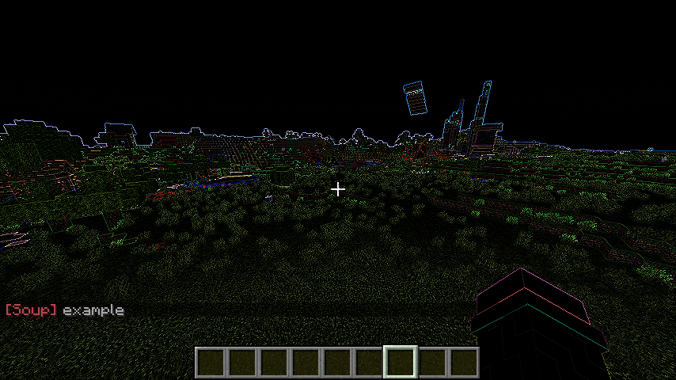
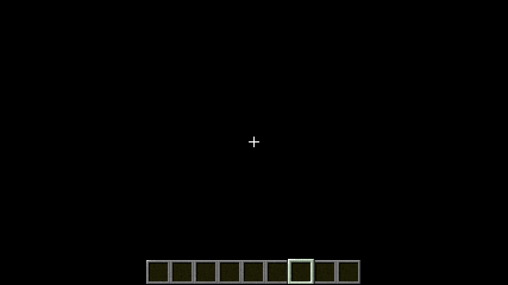
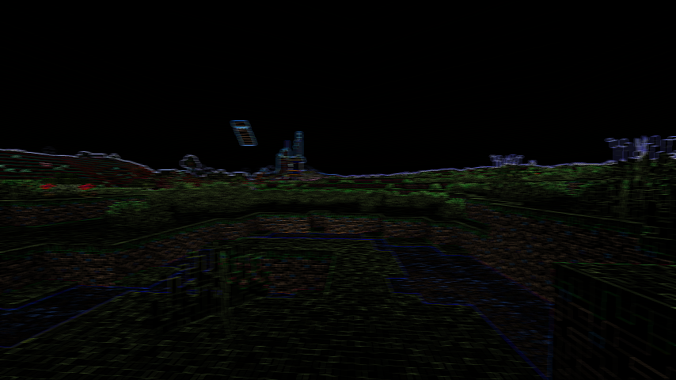
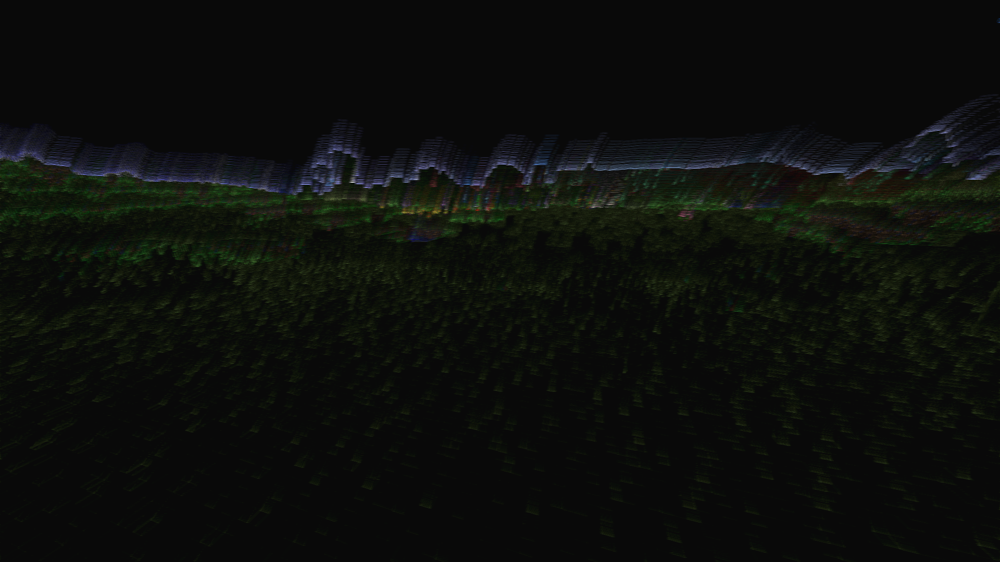
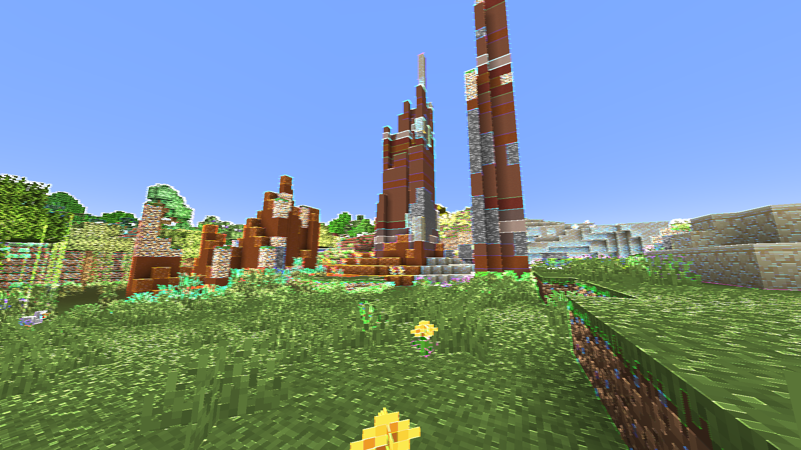

# Adding a Shader

We can add new shaders by adding an element to the namespaces list, and setting the namespace to the name of the folders we will be using to hold `shaders/post` and `shaders/program`, which in this example, will be "tutorial_shader", and the name of our shader will be "example"

```
TutorialShader
├── assets
│   ├── souper_secret_settings
│   │   └── shaders.json
│   └── *tutorial_shader*
│       └── shaders
|           ├── post
|           |   └── *example.json*
|           └── program/...
├── pack.mcmeta
└── pack.png
```

```json
assets/souper_secret_settings/shaders.json
{
    "namespaces": [
        {
            "replace": false,
            "namespace": "tutorial_shader",
            "shaders": [
                "example"
            ]
        }
    ]
}
```

Now that Souper Secret Settings knows about the shader, the shader needs its render passes setup, so add a file in `<namespace>/shaders/post` called `<name>.json`

Its very useful to be able able to reference minecrafts shader assets while doing this - if you cant be bothered to unzip the jar yourself, you can look at https://mcasset.cloud/1.19.3/assets/minecraft/shaders or  the builtin [expanded shaders](https://github.com/Nettakrim/Souper-Secret-Settings/tree/main/src/main/resources/resourcepacks/expanded_shaders) resourcepack

*This section will explain how to add a modified vanilla shader program, to see how to write custom shaders, skip to the section on [writing shader code](WritingShaderCode.md), which will assume you have understanding of how the post shader files covered in this section work.*

# Post Shaders

for a fun base to work off of, im going to copy vanillas `assets/minecraft/shaders/post/sobel.json` as it looks cool, this means I have this file:

```json
assets/tutorial_shader/shaders/post/example.json
{
    "targets": [
        "swap"
    ],
    "passes": [
        {
            "name": "sobel",
            "intarget": "minecraft:main",
            "outtarget": "swap"
        },
        {
            "name": "blit",
            "intarget": "swap",
            "outtarget": "minecraft:main"
        }
    ]
}
```

Now, if i do `/soup:set example`, instead of breaking it will do the fun outline effect!


There are 2 parts to the post shader, a list of targets, and a list of passes:

## Targets

A rendering pass requires something to render to or from, so in the "targets" list we put the names of all our frame buffers - which can be thought of as images we can write to and read from.

Generally minecraft's shaders follow the standard where if theres only one target its called "swap", otherwise they are named "0", "1", "2" etc, or rarely named based on their purpose, but their names can be anything!

## Passes

Each pass in the list is applied one after the other as a sequence of steps

A pass has 3 parts:

- the name of the shader program
- the input frame buffer
- the output frame buffer

```json
{
    "name": "sobel",
    "intarget": "minecraft:main",
    "outtarget": "swap"
}
```


The name tells the render pass to use the program in `minecraft/shaders/program/<name>.json`

- Souper Secret Settings allows for namespaces to be used in program names, so a name of "tutorial_shader:example" would point to `tutorial_shader/shaders/program/example.json` (more detail on this later)

The input target is what the shader program reads, and the output is what it writes to

The target "minecraft:main" represents the screen, so a post shader should generally end with the outtarget being minecraft:main - otherwise you wont see anything change!
- Souper Secret Settings also allows for "minecraft:main:depth" to work on post shaders other than transparency.json, allowing for fun depth based shaders - however this only works for auxtargets (more detail later)

The `blit` program copies one target to another, so once weve rendered a sobelled minecraft:main to the "swap" frame buffer, we then copy it back to the main buffer with

```json
{
    "name": "blit",
    "intarget": "swap",
    "outtarget": "minecraft:main"
}
```

The in and out targets cannot be the same, as a buffer cant be read from and written to at the same time


# The fun bit!
Ok now that you hopefully know how the render passes work, its time to combine them in some fun ways!

So i have my sobel shader from before, and saw that stacking "blur" on top of it gives everything a weird ghostly look, so lets make that into a single shader

Looking at `minecraft/shaders/post/blur.json` to try figure out how to combine them, I can see that its way more complicated looking, whats that about?

```json
minecraft/shaders/post/blur.json
{
    "targets": [
        "swap"
    ],
    "passes": [
        {
            "name": "blur",
            "intarget": "minecraft:main",
            "outtarget": "swap",
            "uniforms": [
                {
                    "name": "BlurDir",
                    "values": [ 1.0, 0.0 ]
                },
                {
                    "name": "Radius",
                    "values": [ 20.0 ]
                }
            ]
        },
        {
            "name": "blur",
            "intarget": "swap",
            "outtarget": "minecraft:main",
            "uniforms": [
                {
                    "name": "BlurDir",
                    "values": [ 0.0, 1.0 ]
                },
                {
                    "name": "Radius",
                    "values": [ 20.0 ]
                }
            ]
        }
    ]
}
```

## Uniforms

Uniforms are another part of each render pass, and they allow for the settings of a shader program to be different for each pass, instead of being hard coded

```json
"uniforms": [
    {
        "name": "BlurDir",
        "values": [ 1.0, 0.0 ]
    },
    {
        "name": "Radius",
        "values": [ 20.0 ]
    }
]
```

Each elemet in the list of uniforms has 2 parts, a name, and a value

To see what uniforms a program has, we can go to it's file!
```
minecraft/shaders/program/blur.json
{
    "blend": {
        "func": "add",
        "srcrgb": "one",
        "dstrgb": "zero"
    },
    "vertex": "sobel",
    "fragment": "blur",
    "attributes": [ "Position" ],
    "samplers": [
        { "name": "DiffuseSampler" }
    ],
    "uniforms": [
        { "name": "ProjMat",     "type": "matrix4x4", "count": 16, "values": [ 1.0, 0.0, 0.0, 0.0, 0.0, 1.0, 0.0, 0.0, 0.0, 0.0, 1.0, 0.0, 0.0, 0.0, 0.0, 1.0 ] },
        { "name": "InSize",      "type": "float",     "count": 2,  "values": [ 1.0, 1.0 ] },
        { "name": "OutSize",     "type": "float",     "count": 2,  "values": [ 1.0, 1.0 ] },
        { "name": "BlurDir",     "type": "float",     "count": 2,  "values": [ 1.0, 1.0 ] },
        { "name": "Radius",      "type": "float",     "count": 1,  "values": [ 5.0 ] }
    ]
}
```

Most of this file is irrelevant to us right now, so lets trim down what we are looking at

```json
"uniforms": [
    { "name": "ProjMat",     "type": "matrix4x4", "count": 16, "values": [ 1.0, 0.0, 0.0, 0.0, 0.0, 1.0, 0.0, 0.0, 0.0, 0.0, 1.0, 0.0, 0.0, 0.0, 0.0, 1.0 ] },
    { "name": "InSize",      "type": "float",     "count": 2,  "values": [ 1.0, 1.0 ] },
    { "name": "OutSize",     "type": "float",     "count": 2,  "values": [ 1.0, 1.0 ] },
    { "name": "BlurDir",     "type": "float",     "count": 2,  "values": [ 1.0, 1.0 ] },
    { "name": "Radius",      "type": "float",     "count": 1,  "values": [ 5.0 ] }
]
```

This still looks quite complicated, but lucky for us, the "ProjMat", "InSize", and "OutSize" uniforms are in pretty much every shader regardless, and we dont ever need (or really want) to touch them, so really all we need to look at is the last two, which can be made slightly more readable by spreading them out

```json
{
    "name": "BlurDir",
    "type": "float",
    "count": 2,
    "values": [ 1.0, 1.0 ]
},
{
    "name": "Radius",
    "type": "float",
    "count": 1,
    "values": [ 5.0 ]
}
```

This is how the program file defines what uniforms it has, in this case we can see that it has 2 relevant uniforms

The name is what we use to change them back in our render pass

the values are what its set to by default, which can give us an idea of what a reasonable input for the uniform is

the type is what type of number is in the "values" list - "float" means its a floating point number, which is a number with a decimal point like 1.0, -0.5, 0.123 etc. You may also see "int", which is an integer, meaning its whole numbers only, like 0, 42, -1 etc

the count is how many of that number is in the "values" list
- a count of 2 often means the uniform represents a vector (position in 2d space)
- a count of 3 often means the uniform represents a color represented as [r, g, b], where [1, 1, 1] is white and [0, 0, 0] is black

## Ok, diversion over

So looking back at the blur render passes, it seems as though it first blurs the image on the horizontal axis with a radius of 20, then does the same on the y axis

This should mean that if I change my example.json shader to

```json
assets/tutorial_shader/shaders/post/example.json
{
    "targets": [
        "swap"
    ],
    "passes": [
        {
            "name": "sobel",
            "intarget": "minecraft:main",
            "outtarget": "swap"
        },
        {
            "name": "blur",
            "intarget": "swap",
            "outtarget": "minecraft:main",
            "uniforms": [
                {
                    "name": "BlurDir",
                    "values": [ 1.0, 0.0 ]
                },
                {
                    "name": "Radius",
                    "values": [ 3.0 ]
                }
            ]
        }
    ]
}
```

it should blur the sobel slightly horizontally, creating 6-7 pixel wide lines



Hmm that doesnt look good, but wait, pressing f1 fixes it?



Lucky for you, i have already suffered through figuring out what the problem here is, and the soloution is simple, if mysterious!

Simply make sure the final pass is a blit, and everything fixes itself

```json
assets/tutorial_shader/shaders/post/example.json
{
    "targets": [
        "0",
        "1"
    ],
    "passes": [
        {
            "name": "sobel",
            "intarget": "minecraft:main",
            "outtarget": "0"
        },
        {
            "name": "blur",
            "intarget": "0",
            "outtarget": "1",
            "uniforms": [
                {
                    "name": "BlurDir",
                    "values": [ 1.0, 0.0 ]
                },
                {
                    "name": "Radius",
                    "values": [ 3.0 ]
                }
            ]
        },
        {
            "name": "blit",
            "intarget": "1",
            "outtarget": "minecraft:main"
        }
    ]
}
```

Interestingly, you dont actually need to reload resources (F3+T) after making a change to the render pass files and just reapplying the shader with /soup:set will work - you do need to reload if you're making changes to shaders.json though

Ok this is looking cool, plus if you stack phosphor you get some funky trails that are helped by the increased width from the blur



Wait, how does phosphor work? lets take a look

```json
minecraft/shaders/post/phosphor.json
{
    "targets": [
        "swap",
        "previous"
    ],
    "passes": [
        {
            "name": "phosphor",
            "intarget": "minecraft:main",
            "outtarget": "swap",
            "auxtargets": [
                {
                    "name": "PrevSampler",
                    "id": "previous"
                }
            ],
            "uniforms": [
                {
                    "name": "Phosphor",
                    "values": [ 0.95, 0.95, 0.95 ]
                }
            ]
        },
        {
            "name": "blit",
            "intarget": "swap",
            "outtarget": "previous"
        },
        {
            "name": "blit",
            "intarget": "swap",
            "outtarget": "minecraft:main"
        }
    ]
}
```

Interesting, it seems to take 2 targets, one for the current frame and one for the previous frame, which it then combines with a slight decay to create a trail

This gives two useful bits of information
- render targets dont get cleared between frames
- some programs have multiple inputs

## Auxtargets

Time to look at the program file to learn more!

```json
minecraft/shaders/program/phosphor.json
{
    "blend": {
        "func": "add",
        "srcrgb": "one",
        "dstrgb": "zero"
    },
    "vertex": "sobel",
    "fragment": "phosphor",
    "attributes": [ "Position" ],
    "samplers": [
        { "name": "DiffuseSampler" },
        { "name": "PrevSampler" }
    ],
    "uniforms": [
        { "name": "ProjMat",  "type": "matrix4x4", "count": 16, "values": [ 1.0, 0.0, 0.0, 0.0, 0.0, 1.0, 0.0, 0.0, 0.0, 0.0, 1.0, 0.0, 0.0, 0.0, 0.0, 1.0 ] },
        { "name": "InSize",   "type": "float",     "count": 2,  "values": [ 1.0, 1.0 ] },
        { "name": "OutSize",  "type": "float",     "count": 2,  "values": [ 1.0, 1.0 ] },
        { "name": "Phosphor", "type": "float",     "count": 3,  "values": [ 0.3, 0.3, 0.3 ] }
    ]
}
```

The important part here is the "samplers" section, which shows two samplers "DiffuseSampler" and "PrevSampler" - usually theres just "DiffuseSampler" - so we can infer that the DiffuseSampler is the intarget, and any extra samplers can be set up with auxtargets

```json
"auxtargets": [
    {
        "name": "PrevSampler",
        "id": "previous"
    }
]
```

The auxtarget syntax back in the render pass is simple enough, it has a name which matches the one in the program file, and an id which is the name of the render target we are inputting

Most shader programs only have one auxtarget if any, but some (like transparency.json) have quite a few, theres not a strict limit

- Souper Secret Settings allows for depth shaders by setting the auxtarget's id to "minecraft:main:depth"

Lets take a quick peek at the fragment shader to see if we can figure out how PrevSampler is used

```
minecraft/shaders/program/phosphor.fsh
--------------------------------------
#version 150

uniform sampler2D DiffuseSampler;
uniform sampler2D PrevSampler;

in vec2 texCoord;
in vec2 oneTexel;

uniform vec2 InSize;

uniform vec3 Phosphor;

out vec4 fragColor;

void main() {
    vec4 CurrTexel = texture(DiffuseSampler, texCoord);
    vec4 PrevTexel = texture(PrevSampler, texCoord);

    fragColor = vec4(max(PrevTexel.rgb * Phosphor, CurrTexel.rgb), 1.0);
}
```

Ok this doesnt look too compilcated - looking just at the main() function at the bottom, we can see a few things
- CurrTexel involves the DiffuseSampler - so it probably means Current Texel
- PrevTexel involves the PrevSampler - so it probably means Previous Texel
- fragColor is set to something involving CurrTexel and PrevTexel

Lets try reverse engineer what this does:
- Just before the main function, we see `out vec4 fragColor;`, so fragColor is probably the color which is outputted
- PrevTexel and CurrTexel are both used with a .rgb - so theyre definately colours
- The color on the screen obviously varies from pixel to pixel, which means PrevTexel and CurrTexel need to be varying too, so texture(Sampler, texCoord) probably means "get the color at this Coordinate" - we see `in vec2 texCoord;` so its presumably an input to the function in some way - "Texture Coordinate" seems like a reasonable expansion of texCoord
- We know that the uniform Phosphor is set to [0.95, 0.95, 0.95], and its being multiplied by the rgb value of the previous frame, this lines up with what we see in game - every frame the trail gets a little darker
- The max() function appears to wrap around the decayed previous color, and the current color, so the overall color of each pixel should be the highest between the current pixel and the previous pixel but a little smaller, this lines up with what we see in game - if we look at some red and green blocks and shake our head, the green channel from the green blocks leaks into the red but slowly decays as its not being refreshed by CurrTexel and each frame it gets multiplied by 0.95, the red channel stays however, as every frame the red value from the red block is higher than the decayed red value of the previous frame


Interestingly, despite being used as motion blur, the overall function is really just `max(a*0.95, b)` for each rgb value in the two samplers - so theres nothing stopping us from using something other than the previous frame as our aux target, or using a different multiplier in the Phosphor uniform for only a specific channel

## Ok, diversion over

So that gives me an idea, what if i set the intarget on a phosphor pass to minecraft:main, and the aux target to the fun blurred sobel, if our theory on how the shader works is correct, the phosphor program should be able to combine the two with a per channel max() function, and it will also have a builtin per channel multiplier for our sobel frame buffer



Yeah! that looks cool, the horizontal blur makes walls have an interesting 3d effect, and the strong rgb colors after the high Phosphor uniform multiplication i used makes it look very "simulationy"

```json
assets/tutorial_shader/shaders/post/example.json
{
    "targets": [
        "0",
        "1"
    ],
    "passes": [
        {
            "name": "sobel",
            "intarget": "minecraft:main",
            "outtarget": "0"
        },
        {
            "name": "blur",
            "intarget": "0",
            "outtarget": "1",
            "uniforms": [
                {
                    "name": "BlurDir",
                    "values": [ 1.0, 0.0 ]
                },
                {
                    "name": "Radius",
                    "values": [ 3.0 ]
                }
            ]
        },
        {
            "name": "phosphor",
            "intarget": "minecraft:main",
            "outtarget": "0",
            "auxtargets": [
                {
                    "name": "PrevSampler",
                    "id": "1"
                }
            ],
            "uniforms": [
                {
                    "name": "Phosphor",
                    "values": [ 10.0, 10.0, 10.0 ]
                }
            ]
        },
        {
            "name": "blit",
            "intarget": "0",
            "outtarget": "minecraft:main"
        }
    ]
}
```

Notice how the this uses the same amount of frame buffers as before as I can reuse "0" - since its contents are no longer needed I can write over it and it doesnt matter

Now just to give it a better name than "example", im thinking "simulation" since it does look a bit like the world is a simulation that is breaking down, this is easy enough to do as I just need to change the name in shaders.json, and then rename the file in tutorial_shader/shaders/post to match

We've already looked a little at the program files, but how do we make them? and what do they actually do? well, for that we need to learn how to [Write Shader Code](WritingShaderCode.md)

You can dowload the resourcepack made in this guide for reference [Here](TutorialShader.zip)