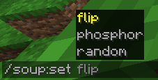

# Resourcepack Setup

For new shaders to be recognised by souper secret settings, add a new file named shaders.json inside assets/souper_secret_settings

Unlike in vanilla, where shaders have to be in minecraft:shaders/(post|program), you can namespace your shader files

For these examples, I will be using a folder layout that looks like this:

```
TutorialShader
├── assets
│   ├── souper_secret_settings
│   │   └── *shaders.json*
│   └── tutorial_shader
│       └── shaders
|           ├── post/...
|           └── program/...
├── pack.mcmeta
└── pack.png
```

# Shaders.json

The shaders.json file follows this format

```json
{
    "namespaces": [
        {
            "replace": false,
            "namespace": "<namespace>",
            "shaders": [
                "<shader name>",
                ...
            ]
        },
        {
            ...
        }
    ],
    "entity_links": {
        "<translation_key>": "<shader name>",
        ...
    }
}
```

## Namespaced Shader Lists

Just looking at a single element of "namespaces", there are 3 parts, "replace", "namespace" and a list called "shaders"

```json
"replace": false,
"namespace": "<namespace>",
"shaders": [
    "<shader name>",
    ...
]
```

namespace controls what namespace the list of shaders is referencing, and therefore what `<namespace>/shaders/post/<shader>` file to reference

if replace is true, then any shaders previously loaded into the namespace get cleared
this means that if we wanted to get rid of all but a select few vanilla shaders, we could do something like this:

```json
{
    "namespaces": [
        {
            "replace": true,
            "namespace": "minecraft",
            "shaders": [
                "flip",
                "phosphor"
            ]
        }
    ]
}
```


And just like that, the player can only access the two most disorienting vanilla shaders!-

Each element is its own namespace, so if you wanted to add a new shader and also remove access to the vanilla ones at the same time, you could do it like this:

```json
{
    "namespaces": [
        {
            "replace": true,
            "namespace": "minecraft",
            "shaders": []
        },
        {
            "replace": false,
            "namespace": "tutorial_shader",
            "shaders": [
                "example"
            ]
        }
    ]
}
```

For information on how to actually add a shader once its registered, look [Here](AddingShaders.md) 

## Entity Links

Entities can be linked to shaders, making certain shaders get applied when spectating them like in vanilla

```json
{
    "namespaces": [...],
    "entity_links": {
        "entity.minecraft.cow": "sobel",
        "entity.minecraft.creeper": "none",
        "entity.minecraft.spider": "blur"
    }
}
```

This can be used to add shaders to entities that dont normally get shaders, clear shaders from enties that do, or change what shader they get

These shaders are loaded using vanillas system, so wont show up on `/soup:query` and cant be cleared with `/soup:clear` etc

If do want it them to have `/soup` functionality, or want to stack shaders, you can use the same syntax used for saving recipes

```json
"entity.minecraft.cow": "1sobel",
"entity.minecraft.pig": "2blobs",
"entity.minecraft.sheep": "2deconverge/1blur/1deconverge"
```

If you get a stack ingame which you want to apply to an entity, you can do `/soup:recipe save <name>`, then look in `<appdata>/.minecraft/.souper_secret_settings.txt`

These shaders are not namespaced, so if you wanted to link a shader like kaleidoscope from the builtin expanded_shaders resourcepack, you just do `"entity.<...>": "kaleidoscope"`

setting the entity as `"entity.minecraft.player"` will make the shader always apply unless the player is spectating an entity and is in first person

## Adding Shaders

Now that your resourcepack is setup to work with souper secret settings, you can [Add Shaders](AddingShaders.md)